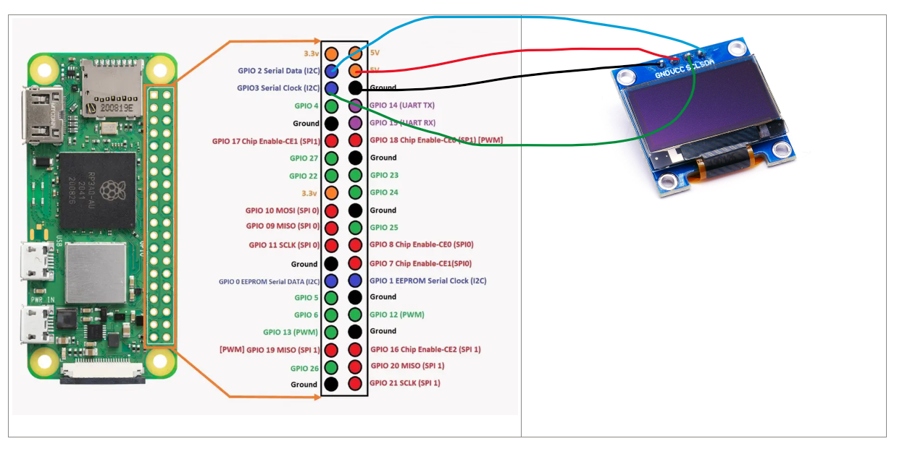

SSD 1306 oled

Raspberry pi 4b in device's gpio interfaces location is same.<br/>
Hardware connection:




# dependencies
```
sudo pip3 install luma.oled
```


REF<br/>
https://www.zhihu.com/question/512819295?utm_id=0